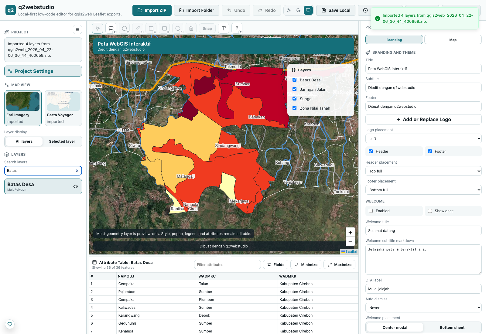

# q2webstudio

[](https://tiptap.gg/dhanypedia)


Browser first, local first editor for qgis2web Leaflet exports.

q2webstudio imports a static qgis2web Leaflet export, lets you edit the map visually, then exports a refreshed static web map that can be served from ordinary static hosting.

## Screenshot



## What it does

q2webstudio helps you import an existing qgis2web Leaflet folder or ZIP file, customize it in the browser, preview the runtime output, and download a new static ZIP. The app is designed for local first editing. Project state can stay in the browser, and the exported result remains a static site.

Typical edits include branding, map view, basemaps, layer visibility, vector styles, labels, legends, popup content, attributes, and supported geometry operations. The runtime export keeps the original qgis2web structure where possible, then adds q2webstudio runtime files for the edited configuration.

## Main features

- Import qgis2web Leaflet folders and ZIP files.
- Service Worker runtime preview served through `/preview/{token}/index.html`.
- Branding, header, footer, basemap, popup, legend, and layer control editing.
- Vector style modes for single symbol, categorized, and graduated layers.
- Attribute table editing for GeoJSON data layers.
- Geometry editing for supported vector layers.
- Raster parity in editor preview, runtime preview, and ZIP runtime for image overlay, WMS, and PMTiles layers.
- Diagnostics for imported projects and visible layer issues.
- Static ZIP export with `q2ws-config.json`, `q2ws-runtime.js`, and `q2ws-custom.css`.

## Quick start

```bash
npm install
npm run dev
```

Then open the local Vite URL in your browser and import a qgis2web Leaflet export folder or ZIP file.

## Verification

Run the core checks before opening a PR:

```bash
npm run build
npm run smoke:fixture
npm run smoke:export
npm run smoke:map
```

For phase work that touches map rendering, runtime preview, export, import, hydration, migration, or schema, also run the relevant Playwright gate. Recent phase gates live in `tests/map-render.spec.ts`.

```bash
npx playwright test tests/map-render.spec.ts -g "phase 7|phase 8|phase 9|phase 10" --reporter=line
```

## Limitations

- Only qgis2web Leaflet exports are supported.
- OpenLayers exports are not supported.
- WMS tile rendering is supported, but WMS GetFeatureInfo remains deferred.
- Rule based styling is not implemented yet.
- Custom CRS reprojection is not implemented yet.
- Direct geometry editing is limited to supported vector geometry types.
- Multi geometry layers can be previewed and managed, but direct geometry editing remains limited.
- Runtime previews are local browser previews, not shareable hosted links.

## Project workflow

- Contributor workflow and PR evidence rules are documented in [CONTRIBUTING.md](CONTRIBUTING.md).
- Preview, import, export, runtime, and CSP architecture are documented in [docs/ARCHITECTURE.md](docs/ARCHITECTURE.md).
- Manual QA expectations are documented in [docs/QA-CHECKLIST-PER-PHASE.md](docs/QA-CHECKLIST-PER-PHASE.md).

## Disclaimer

q2webstudio is an independent editor for qgis2web exports and is not affiliated with qgis2web or OSGeo.

## License

This project is licensed under the MIT License. See `LICENSE` for details.
